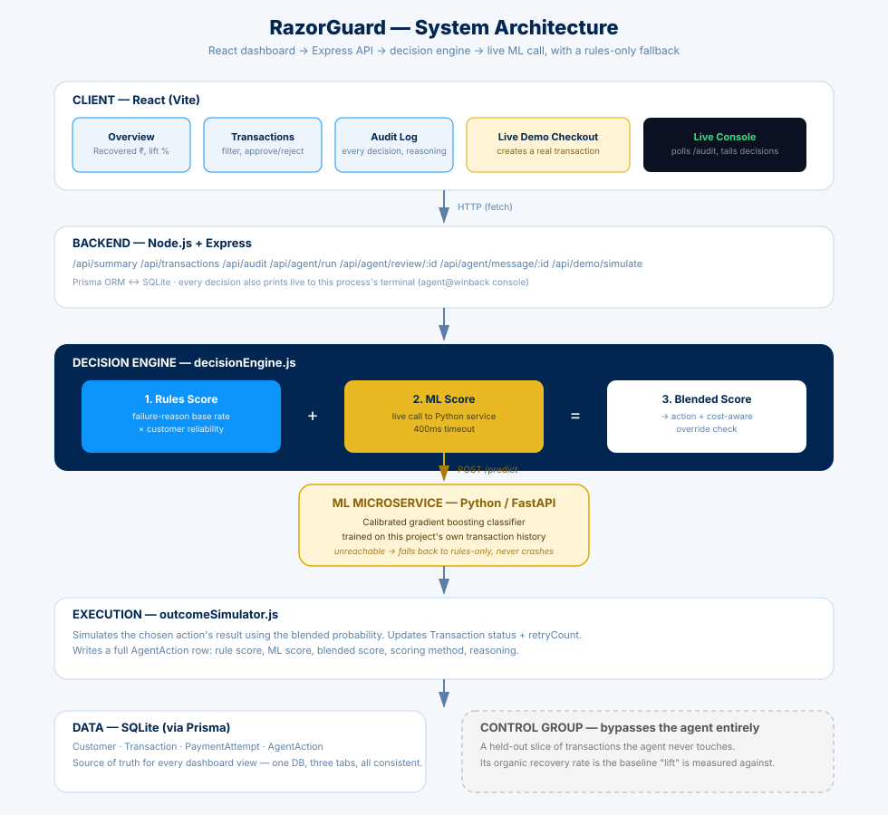

# RazorGuard — AI Revenue Recovery Agent

**Don't just lose the sale. Chase it back.**

Built for Razorpay's AI Buildathon — Track 03: AI Revenue Recovery.

RazorGuard is an agent that looks at a batch of failed payments, decides which ones are worth chasing and how, actually attempts the recovery, and keeps a complete, readable log of every decision it made and why — including the ones it chose *not* to act on.

## 🚀 Live Demo

**https://razorguard-frontend.onrender.com/**

*(If the dashboard loads but no data appears, the backend may not be reachable from this deployment — see [Running it locally](#running-it-locally) for the reliable path.)*

---

## The Problem, in One Sentence

A payment fails, and most businesses either retry it blindly (wasting effort on hopeless cases) or write it off entirely (losing money that was genuinely recoverable). RazorGuard tries to tell the difference.

---

## What It Actually Does

For every at-risk transaction, RazorGuard runs a loop:

1. **Diagnose** — why did this fail? (issuer decline, expired card, network timeout, insufficient funds, failed 3DS authentication, other)

2. **Score (rules)** — combine the failure reason's typical recoverability with this specific customer's payment history into a 0–1 recovery score.

3. **Score (ML)** — an independent gradient-boosting classifier, trained on this project's own transaction history and served by a separate Python microservice, estimates the recovery probability of the specific action being considered.

4. **Blend** — the rules score and ML score are combined into a final recovery score. If the ML service is unreachable, the engine falls back to the rules score alone and logs that fact — a live demo never crashes just because a Python process isn't running.

5. **Decide** — pick an action: retry, send a reminder, request an updated payment method, escalate to a human, or stop. A cost-aware check can downgrade a decision to "stop" if attempting it would cost more than it's expected to recover.

6. **Execute** — simulate the outcome of that action (no real payment gateway is called — see [Honest Limitations](#honest-limitations)).

7. **Escalate when uncertain** — if the score is genuinely ambiguous, RazorGuard doesn't guess. It routes the case to a human review queue instead of auto-acting, and a person can approve or reject it from the dashboard.

8. **Draft customer outreach** — for actions that need customer-facing follow-up, RazorGuard can generate a plain-language recovery message, or a warm Hinglish payment-plan offer script — both are drafts for a human to send, not sent automatically.

9. **Log everything** — every decision, including stops and rejections and which scoring method was used, is written to an audit trail with its reasoning attached. The same feed also prints live, in color, to the server terminal as it happens.

---

## How to Actually Use It — A Walkthrough

If you're opening the dashboard for the first time, here's what each tab is for and what to actually click:

- **Overview** — your one-glance summary: total recovered, the causal lift over a do-nothing baseline, and how many transactions are still retrying, pending human review, or written off. Click **"Run agent on open transactions"** here to process a fresh batch.

- **Transactions** — the full list, filterable by group (treatment/control) and status. This is where you act: **Approve/Reject** on anything pending human review, or **Generate message** / **Hinglish Offer** on anything needing customer outreach.

- **Audit Log** — a live, timestamped feed of every decision the agent (or a human reviewer) has made, with the reasoning and rules/ML/blended scores spelled out for each one.

- **Make a Payment** — a simulated checkout. Submit a test card and amount, and watch the *entire real pipeline* run live in front of you: failure → diagnosis → scoring → decision → outcome. This is the fastest way to demo the whole system in one place.

- **Live Console** — a terminal-style feed showing agent decisions print in real time as they happen, whether triggered from a batch run or a single demo payment.

---

## Proving It Actually Works — Not Just Reporting a Number

A slice of transactions is deliberately held out as a **control group** that RazorGuard never touches.

Comparing the treatment group's recovery rate against this untouched baseline is what turns:

> "We recovered ₹X"

into:

> "We recovered ₹X *more than would have come back on its own*"

— the real, causal contribution of the agent, not just a raw count that could include payments that would have resolved anyway.

---

## Architecture



React dashboard → Express API → decision engine, which computes a rules score and makes a live call to the Python ML microservice, blends the two, and falls back to rules-only if the ML service is unreachable.

Every decision writes to SQLite via Prisma, the single source of truth all dashboard tabs read from.

The control group bypasses the agent entirely and is resolved independently, as the baseline the agent's lift is measured against.

---

## Tech Stack

- **Backend:** Node.js, Express, Prisma ORM, SQLite
- **ML service:** Python, scikit-learn (gradient boosting, calibrated), FastAPI — served independently on its own port and called live by the decision engine
- **Frontend:** React (Vite), Tailwind CSS
- **Decision logic:** a blend of hand-tuned rules (structure, reliability, safety overrides) and a trained ML model (interaction effects the rules table can't express) — see [The ML Layer, Honestly](#the-ml-layer-honestly)

---

## Project Structure

```text
razorguard/
│
├── server/
│   ├── prisma/
│   │   ├── schema.prisma        # Customer, Transaction, PaymentAttempt, AgentAction
│   │   └── seed.js              # Generates synthetic at-risk transactions
│   │
│   └── src/
│       ├── services/
│       │   ├── decisionEngine.js        # Diagnose, rules score, ML call, blend, decide, cost-aware override
│       │   ├── outcomeSimulator.js      # Simulates the result of an action
│       │   ├── agent.js                 # Orchestrates the batch loop + single-transaction processing
│       │   ├── messageGenerator.js      # Plain-language customer recovery messages
│       │   └── hinglishRecoveryAgent.js # Hinglish payment-plan offer drafts (Groq)
│       │
│       ├── routes/
│       │   ├── transactions.js  # /summary, /transactions, /audit (read-only)
│       │   ├── agent.js         # /agent/run, /agent/review/:id, /agent/message/:id
│       │   └── demo.js          # /demo/simulate -- powers the live checkout demo
│       │
│       └── utils/
│           └── consoleLogger.js # Colored real-time decision logging to the server terminal
│
├── ml/
│   ├── data/                    # Exported training data (CSV)
│   ├── model/                   # Trained model, metrics, calibration/feature-importance charts
│   ├── train_model.py           # Training + evaluation pipeline
│   ├── serve.py                 # FastAPI service the decision engine calls live
│   └── requirements.txt
│
├── client/
│   └── src/
│       ├── components/
│       │   ├── Overview.jsx           # Headline numbers + lift
│       │   ├── TransactionsTable.jsx  # Full list, filters, approve/reject, message generation
│       │   ├── AuditLog.jsx           # Global decision feed
│       │   ├── MockCheckout.jsx        # Live demo: simulated checkout → real pipeline
│       │   └── LiveConsole.jsx         # Real-time decision feed
│       │
│       └── App.jsx
│
└── docs/
    └── architecture.svg
